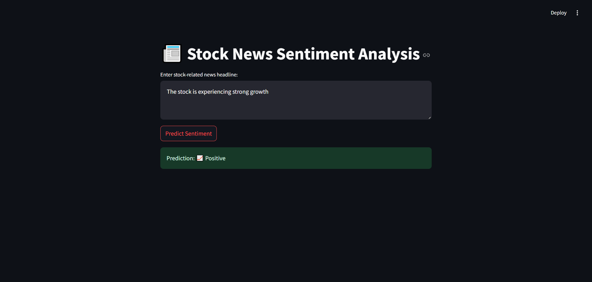

# 📈 Stock News Sentiment Analysis Web App

This project is a **Machine Learning web application** that analyzes stock-related news headlines and predicts whether the sentiment is **positive** or **negative**. It helps investors quickly understand the emotional tone of news that could impact market decisions.

---

## 🚀 Project Overview

- 🗞️ **Input**: Stock market news headlines (e.g.,"Company shares soar after earnings report")
- 🧠 **Model**: Logistic Regression
- 📊 **Vectorizer**: TF-IDF (Text Feature Extraction)
- 📁 **Dataset Source**: Kaggle - [Yash612 Stock Market News Dataset](https://www.kaggle.com/datasets/yash612/stock-market-news-dataset)
- 🎯 **Target**: Binary classification (Positive = 1, Negative = -1)
- ✅ **Achieved Accuracy**: ~80%
- 🌐 **Frontend**: Streamlit

---

## 📁 Folder Structure
stock-sentiment-analysis/
│
├── app.py # Streamlit Web Application
├── sentiment_model.pkl # Trained Logistic Regression Model
├── vectorizer.pkl # TF-IDF Vectorizer (Used for Prediction)
├── requirements.txt # Python Libraries Required
├── README.md # Project Documentation

---

## 🧪 Setup Instructions

1️⃣ Clone the Repository
git clone https://github.com/RaiyanCoder7/stock-sentiment-analysis.git
cd stock-sentiment-analysis

2️⃣ Install Dependencies
pip install -r requirements.txt

3️⃣ Run the Streamlit App
streamlit run app.py

The app will open in your browser at http://localhost:8501.

---

🖥️ Web App Features
*Enter any stock-related headline
*Click Predict
*Get real-time feedback: Positive or Negative

---

🧠 Sample Headlines
Try testing these:

✅ Positive:
"Company's revenue exceeds expectations in Q4"
"New partnership boosts tech stock performance"

❌ Negative:
"Market plunges amid economic uncertainty"
"Company faces massive data breach affecting users"

---

📈 Model Training Details
*Text Cleaning: Lowercasing, punctuation removal, stopword filtering
*Tokenizer: NLTK word_tokenize()
*Model: LogisticRegression(class_weight="balanced")
*Evaluation Metrics:
>Accuracy: 79%
>Confusion Matrix: TP/TN/FP/FN counts
>F1 Score, Precision, Recall

---

🛠️ Requirements (in requirements.txt)
streamlit
scikit-learn
pandas
nltk
joblib

---

📸 Screenshot

---

👤 Author
Made by MD Raiyan Raza Khan
📬 GitHub: https://github.com/RaiyanCoder7

If you found this helpful, ⭐ star the repo!

